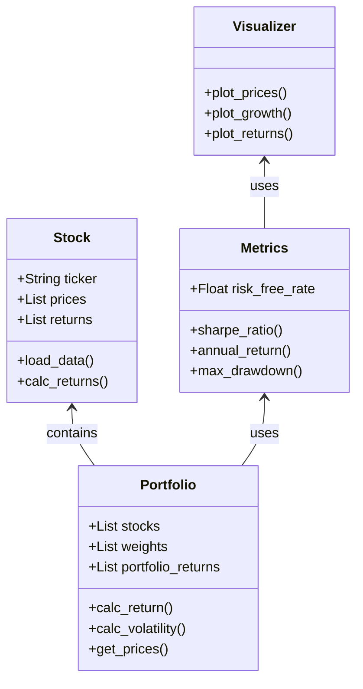

## 📌 Περιγραφή
Ο **Portfolio Analyzer** είναι ένα εργαλείο σε Python που επιτρέπει στους χρήστες να αναλύουν, να οπτικοποιούν και να διαχειρίζονται επενδυτικά χαρτοφυλάκια μετοχών. Υπολογίζει βασικά metrics κινδύνου και απόδοσης και παράγει διαγράμματα για την ιστορική εξέλιξη των τιμών.

## 🚀 Χαρακτηριστικά
* **Λήψη Δεδομένων:** Αυτόματη φόρτωση ιστορικών τιμών μετοχών.
* **Υπολογισμός Metrics:** * Ετήσια απόδοση (Annual Return)
  * Sharpe Ratio (Απόδοση σε σχέση με τον κίνδυνο)
  * Maximum Drawdown (Μέγιστη ιστορική υποχώρηση)
* **Οπτικοποίηση:** Σχεδιασμός διαγραμμάτων για τις τιμές, τις αποδόσεις και την ανάπτυξη του χαρτοφυλακίου.

## 🛠️ Τεχνολογίες
* **Python 3.x**
* **Pandas / NumPy** (για την ανάλυση των δεδομένων και των returns)
* **Matplotlib / Seaborn** (για τη δημιουργία των διαγραμμάτων στον Visualizer)
* **yfinance** (για να τραβάμε live τιμές μετοχών)

