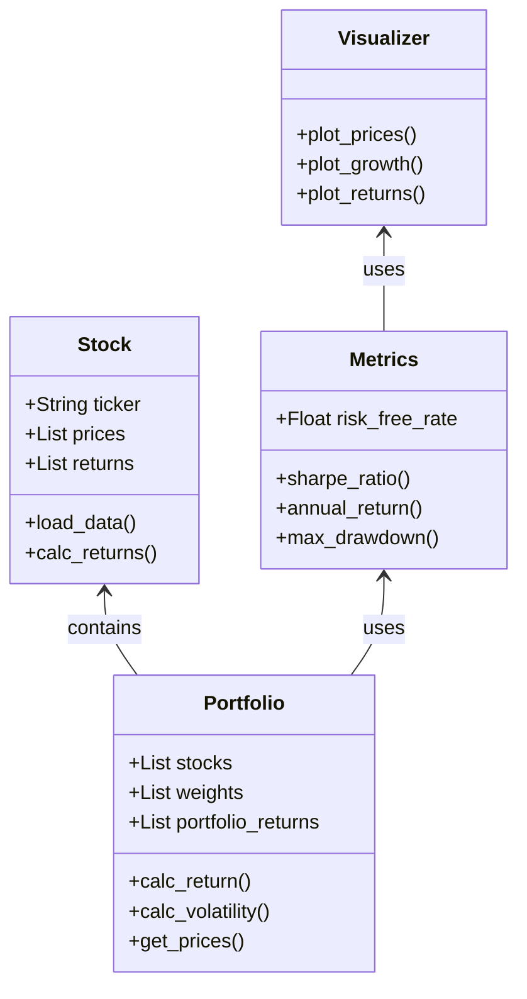

```mermaid
classDiagram
    direction BT
    
    class Stock {
        +String ticker
        +List prices
        +List returns
        +load_data()
        +calc_returns()
    }

    class Portfolio {
        +List stocks
        +List weights
        +List portfolio_returns
        +calc_return()
        +calc_volatility()
        +get_prices()
    }

    class Metrics {
        +Float risk_free_rate
        +sharpe_ratio()
        +annual_return()
        +max_drawdown()
    }

    class Visualizer {
        +plot_prices()
        +plot_growth()
        +plot_returns()
    }

    Portfolio --> Stock : contains
    Portfolio --> Metrics : uses
    Metrics --> Visualizer : uses
```