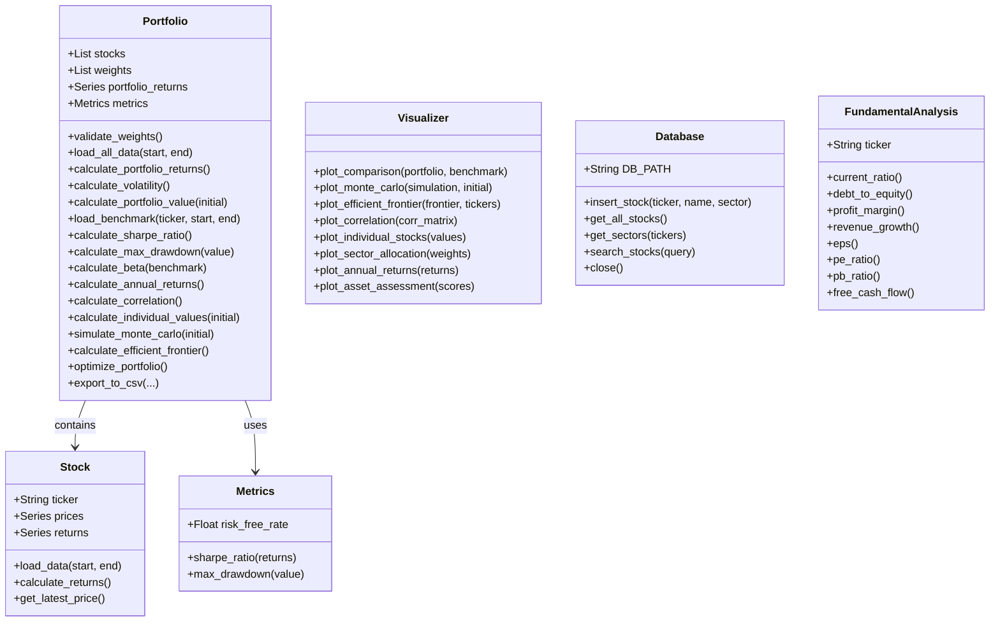

## 📌 Περιγραφή
Ο **Portfolio Analyzer** είναι μια web εφαρμογή σε Python που επιτρέπει στους χρήστες να αναλύουν, να οπτικοποιούν και να διαχειρίζονται επενδυτικά χαρτοφυλάκια μετοχών. Υπολογίζει metrics κινδύνου και απόδοσης, εκτελεί προχωρημένες χρηματοοικονομικές αναλύσεις και παρέχει θεμελιώδη ανάλυση εταιρειών.

## 🚀 Χαρακτηριστικά

### Portfolio Analysis
* **Σύγκριση με S&P 500** — Portfolio vs Benchmark γράφημα
* **Risk Metrics** — Sharpe Ratio, Max Drawdown, Volatility, Beta
* **Annual Returns** — Ετήσια απόδοση ανά χρόνο
* **Sector Allocation** — Κατανομή ανά κλάδο
* **Risk Warnings** — Αυτόματες ειδοποιήσεις βάσει metrics

### Advanced Finance
* **Monte Carlo Simulation** — 1000 σενάρια για το μελλοντικό portfolio
* **Efficient Frontier** — Βέλτιστη κατανομή risk/return
* **Markowitz Optimization** — Μαθηματική βελτιστοποίηση weights
* **Correlation Matrix** — Συσχέτιση μεταξύ μετοχών

### Stock Analysis
* **Fundamental Analysis** — Ανάλυση ισολογισμών εταιρείας
* **Asset Assessment** — Radar chart με score 0-10 ανά metric
* **Financial Checklist** — ✅/❌ έλεγχος 8 χρηματοοικονομικών δεικτών

### Άλλα
* **Αναζήτηση μετοχών** — Βάση δεδομένων 100 γνωστών μετοχών
* **Date Range Selector** — 1Y / 3Y / 5Y / 10Y / Custom
* **Export to CSV** — Εξαγωγή αποτελεσμάτων

## 🛠️ Τεχνολογίες
* **Python 3.x**
* **Pandas / NumPy** — Ανάλυση δεδομένων και returns
* **Plotly** — Interactive γραφήματα
* **Streamlit** — Web UI
* **yfinance** — Live τιμές και οικονομικά στοιχεία μετοχών
* **SciPy** — Portfolio optimization (SLSQP)
* **SQLite** — Βάση δεδομένων μετοχών

## 🚀 Εκκίνηση

```bash
pip install -r requirements.txt
python init_db.py
streamlit run app.py
```

## 🗂️ Δομή Project

```
PortfolioAnalyzer/
├── app.py              # Streamlit UI
├── main.py             # CLI entry point
├── init_db.py          # Αρχικοποίηση βάσης δεδομένων
├── requirements.txt
└── src/
    ├── stock.py         # Stock class
    ├── portfolio.py     # Portfolio class
    ├── metrics.py       # Metrics class
    ├── visualizer.py    # Visualizer class
    ├── fundamentals.py  # FundamentalAnalysis class
    └── database.py      # Database class
```

## 📊 UML Διάγραμμα


