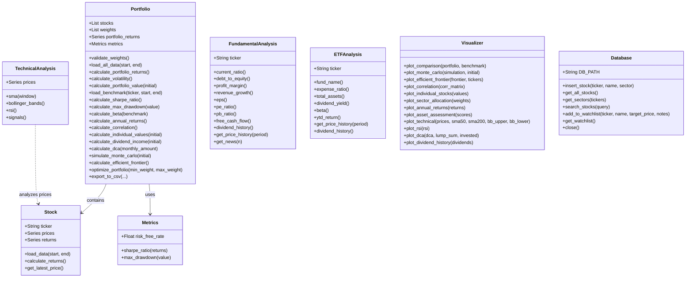

## 📌 Περιγραφή
Ο **Portfolio Analyzer** είναι μια web εφαρμογή σε Python (Streamlit) που λειτουργεί σαν προσωπικό επενδυτικό dashboard: ο χρήστης καταχωρεί τις πραγματικές του αγορές μετοχών, και η εφαρμογή υπολογίζει απόδοση και ρίσκο, τρέχει προχωρημένη χρηματοοικονομική ανάλυση (Markowitz, Monte Carlo, Rebalancing), παρακολουθεί watchlist και earnings, και προσφέρει πλήρη ανάλυση (θεμελιώδη + τεχνική + analyst consensus) για οποιαδήποτε μετοχή ή ETF.

## 🚀 Χαρακτηριστικά

### 🏠 Home
* **Ζωντανό ticker** — κυλιόμενη μπάρα με 16 δείκτες/μετοχές/commodities/FX (S&P 500, Nasdaq, Dow, DAX, FTSE, μεγάλες τεχνολογικές, χρυσός, πετρέλαιο, Bitcoin, EUR/USD)
* **Χρηματοοικονομικά νέα** — hero card + grid άρθρων με εικόνες, από τα κυριότερα σύμβολα της αγοράς

### 💼 My Portfolio
* **Οδηγός εισαγωγής** — πλήρης οθόνη καταχώρησης αγορών (μετοχή, ημερομηνία, ποσό) μέσω data editor
* **Σύγκριση με S&P 500** — Portfolio vs Benchmark γράφημα
* **Risk Metrics** — Sharpe Ratio, Max Drawdown, Volatility, Beta
* **Ετήσιες Αποδόσεις** & **Ανάλυση ανά Μετοχή**
* **Sector Allocation** — κατανομή χαρτοφυλακίου ανά κλάδο
* **Dividend Income** — αναμενόμενο μερισματικό εισόδημα ανά θέση
* **DCA vs Lump Sum** — σύγκριση σταδιακής έναντι εφάπαξ επένδυσης
* **Export** — αναφορά σε PDF και εξαγωγή αποτελεσμάτων σε CSV

### 📈 Markowitz Optimization
* **Efficient Frontier** — 5.000 τυχαία χαρτοφυλάκια, risk/return scatter
* **Βέλτιστα Weights** — μεγιστοποίηση Sharpe Ratio μέσω SLSQP
* **Correlation Matrix** — συσχέτιση μεταξύ των μετοχών του χαρτοφυλακίου

### ⚖️ Rebalancing
* Ορισμός target weights ανά μετοχή με real-time έλεγχο αθροίσματος 100%
* Υπολογισμός BUY/SELL/HOLD ανά θέση, με βάση configurable threshold
* Σύνοψη (σύνολο αγορών/πωλήσεων, καθαρή ρευστότητα) + γράφημα τρέχουσας vs στοχευμένης κατανομής

### 👀 Watchlist
* Παρακολούθηση μετοχών εκτός χαρτοφυλακίου με ζωντανές τιμές
* Ορισμός τιμής-στόχου (target price) και σημειώσεων ανά μετοχή
* Μόνιμη αποθήκευση σε SQLite

### 📅 Earnings Calendar
* Επερχόμενες ανακοινώσεις αποτελεσμάτων για τις μετοχές του χαρτοφυλακίου
* Ξεχωριστή προβολή για μεγάλες γνωστές εταιρείες, ομαδοποιημένη ανά εβδομάδα

### 🔍 Stock Analysis
* **Fundamental Analysis** — ανάλυση ισολογισμού, P/E, P/B, περιθώριο κέρδους, χρέος/ίδια κεφάλαια
* **Asset Assessment** — radar chart με score ανά metric + checklist χρηματοοικονομικής υγείας
* **Peer Comparison** — σύγκριση με μετοχές ίδιου κλάδου
* **Analyst Consensus** — consensus rating (Strong Buy…Sell), mean/median τιμή-στόχος 12μήνου, εύρος low/high, αριθμός αναλυτών
* **Technical Analysis** — RSI(14), SMA(50/200), Bollinger Bands, αυτόματα σήματα buy/sell/neutral
* **ETF Analysis** — expense ratio, AUM, dividend yield, beta, ιστορική απόδοση (YTD/3Y/5Y)
* **Dividend History** & **Latest News** ανά μετοχή

## 🛠️ Τεχνολογίες
* **Python 3.x**
* **Pandas / NumPy** — ανάλυση δεδομένων και returns
* **Plotly** — interactive γραφήματα
* **Streamlit** — web UI
* **yfinance** — ζωντανές τιμές, νέα, ημερολόγιο αποτελεσμάτων, θεμελιώδη στοιχεία
* **SciPy** — portfolio optimization (SLSQP)
* **SQLite** — βάση δεδομένων μετοχών & watchlist
* **fpdf2 / kaleido** — δημιουργία PDF αναφοράς με ενσωματωμένα γραφήματα

## 🚀 Εκκίνηση

```bash
pip install -r requirements.txt
python init_db.py
streamlit run app.py
```

## 🗂️ Δομή Project

```
PortfolioAnalyzer/
├── app.py              # Streamlit UI (Home, Portfolio, Markowitz, Rebalancing, Watchlist, Earnings, Stock Analysis)
├── main.py             # CLI entry point
├── init_db.py          # Αρχικοποίηση βάσης δεδομένων μετοχών
├── requirements.txt
└── src/
    ├── stock.py         # Stock class
    ├── portfolio.py     # Portfolio class (returns, risk, Monte Carlo, Markowitz, DCA...)
    ├── metrics.py        # Metrics class (Sharpe, Max Drawdown)
    ├── technical.py      # TechnicalAnalysis class (RSI, SMA, Bollinger, σήματα)
    ├── fundamentals.py   # FundamentalAnalysis class
    ├── etf.py            # ETFAnalysis class
    ├── visualizer.py      # Visualizer class (όλα τα Plotly γραφήματα)
    ├── report.py          # Δημιουργία PDF αναφοράς
    └── database.py        # Database class (μετοχές + watchlist)
```

## 📊 UML Διάγραμμα


```mermaid
classDiagram
    direction TB

    class Stock {
        +String ticker
        +Series prices
        +Series returns
        +load_data(start, end)
        +calculate_returns()
        +get_latest_price()
    }

    class Portfolio {
        +List stocks
        +List weights
        +Series portfolio_returns
        +Metrics metrics
        +validate_weights()
        +load_all_data(start, end)
        +calculate_portfolio_returns()
        +calculate_volatility()
        +calculate_portfolio_value(initial)
        +load_benchmark(ticker, start, end)
        +calculate_sharpe_ratio()
        +calculate_max_drawdown(value)
        +calculate_beta(benchmark)
        +calculate_annual_returns()
        +calculate_correlation()
        +calculate_individual_values(initial)
        +calculate_dividend_income(initial)
        +calculate_dca(monthly_amount)
        +simulate_monte_carlo(initial)
        +calculate_efficient_frontier()
        +optimize_portfolio(min_weight, max_weight)
        +export_to_csv(...)
    }

    class Metrics {
        +Float risk_free_rate
        +sharpe_ratio(returns)
        +max_drawdown(value)
    }

    class TechnicalAnalysis {
        +Series prices
        +sma(window)
        +bollinger_bands()
        +rsi()
        +signals()
    }

    class FundamentalAnalysis {
        +String ticker
        +current_ratio()
        +debt_to_equity()
        +profit_margin()
        +revenue_growth()
        +eps()
        +pe_ratio()
        +pb_ratio()
        +free_cash_flow()
        +dividend_history()
        +get_price_history(period)
        +get_news(n)
    }

    class ETFAnalysis {
        +String ticker
        +fund_name()
        +expense_ratio()
        +total_assets()
        +dividend_yield()
        +beta()
        +ytd_return()
        +get_price_history(period)
        +dividend_history()
    }

    class Visualizer {
        +plot_comparison(portfolio, benchmark)
        +plot_monte_carlo(simulation, initial)
        +plot_efficient_frontier(frontier, tickers)
        +plot_correlation(corr_matrix)
        +plot_individual_stocks(values)
        +plot_sector_allocation(weights)
        +plot_annual_returns(returns)
        +plot_asset_assessment(scores)
        +plot_technical(prices, sma50, sma200, bb_upper, bb_lower)
        +plot_rsi(rsi)
        +plot_dca(dca, lump_sum, invested)
        +plot_dividend_history(dividends)
    }

    class Database {
        +String DB_PATH
        +insert_stock(ticker, name, sector)
        +get_all_stocks()
        +get_sectors(tickers)
        +search_stocks(query)
        +add_to_watchlist(ticker, name, target_price, notes)
        +get_watchlist()
        +close()
    }

    Portfolio --> Stock : contains
    Portfolio --> Metrics : uses
    TechnicalAnalysis ..> Stock : analyzes prices
```
